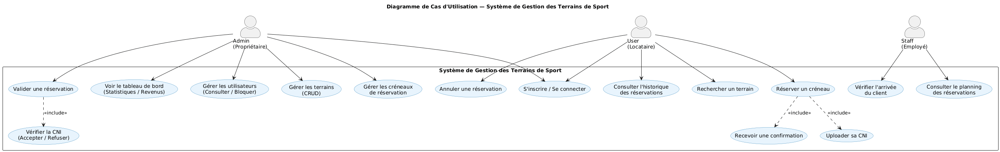
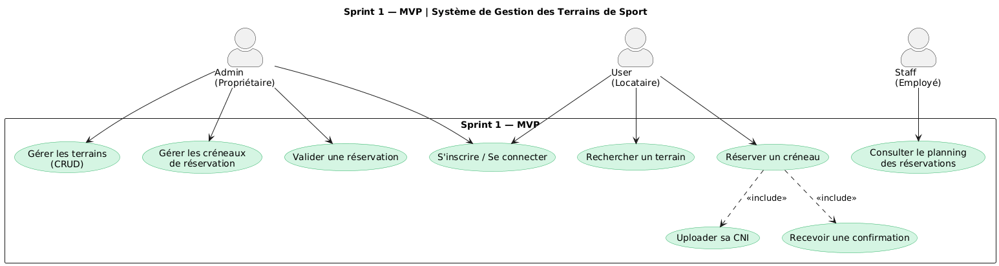
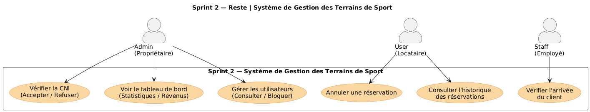

  
  

# **Projet de Fin de Formation**

### \*\* Système de Gestion des Terrains de Sport

**Réalisé par :** Adnane Kesksu
**Encadré par :** M. ESSARRAJ Fouad  
**Filière :** Développement Mobile et Web

---

## Sommaire

  

1

Contexte du projet

  

2

Méthodologie de travail

  

3

Branche Fonctionnelle

  

4

Branche Technique

  

5

Conception

  

6

Démonstration

  

7

Conclusion

---

## 1. Contexte du projet

- M. Karim est propriétaire d'un complexe sportif de 4 terrains loués à l'heure. Malgré une clientèle fidèle, il gère tout manuellement — appels téléphoniques et cahier manuscrit — ce qui entraîne des créneaux perdus, des doubles réservations et un suivi financier inexistant.
  Ce projet vise à concevoir une plateforme numérique qui automatise les réservations, intègre une vérification d'identité (CNI), et donne au propriétaire un contrôle total sur son complexe

---

## 2. Méthodologie : Design Thinking

  

---

## Méthodologie : Scrum (Agile)

  

---

## 3. Branche Fonctionnelle : Design Thinking

### 1. EMPATHIE

  

    <h4>Comprendre l'utilisateur</h4>
    <blockquote style="font-style: italic; background: white; padding: 15px; border-radius: 8px;">
     Propriétaire : "Observation des difficultés réelles du propriétaire dans la gestion quotidienne : pertes de réservations par téléphone, doubles créneaux et absence totale de suivi financier."
Client / Locataire : "Observation des frustrations du locataire lors de la réservation : temps perdu à rappeler, aucune visibilité sur les disponibilités et risque de trouver un autre groupe sur son terrain."
Staff / Employé : "Observation des difficultés de l'employé sur le terrain : vérification manuelle des réservations à l'accueil, gestion seul des conflits clients et dépendance aux consignes transmises par WhatsApp."
    </blockquote>
  

---

## Branche Fonctionnelle : Design Thinking

### 2. DÉFINITION

  

    <h4>Cadrage du problème</h4>
    <blockquote style="font-style: italic; background: white; padding: 15px; border-radius: 8px;">
    "Comment digitaliser la gestion des terrains pour éliminer les pertes de réservations, les conflits de créneaux et la dépendance au téléphone ?"
Focus sur : L'automatisation, la vérification d'identité (CNI) et le contrôle en temps réel.Share
    </blockquote>
   
  

---

## Branche Fonctionnelle : Design Thinking

### 3. IDÉATION

  

    <h4>Solutions retenues</h4>
    
• Plateforme de réservation en ligne 24h/24 pour éliminer le téléphone.

    
•  Upload de la CIN avec validation admin avant confirmation du créneau.

    
•Dashboard temps réel pour le suivi des terrains, réservations et revenus.
Share.

  

---

## Branche Fonctionnelle : Cas d'utilisation

### Global Use Case

  <h3>Interaction Utilisateur (UML)</h3>
  

---

## Branche Fonctionnelle : Cas d'utilisation

### Sprint 1 :

  

    
  

---

## Branche Fonctionnelle : Cas d'utilisation

### sprint 2:

 

  

    
  

---

## 4. Branche Technique : Tech Stack

  

    <h4>Les technologies à utiliser</h4>
    <ul>
      <li><strong>Base de données:</strong> MySQL</li>
      <li><strong>Framework:</strong> Laravel 12</li>
      <li><strong>Architecture N-Tiers:</strong>
        <ul style="margin-top: 5px;">
          <li>Controller: Requêtes HTTP</li>
          <li>Service: Logique métier</li>
          <li>Model: Base de données</li>
        </ul>
      </li>
      <li><strong>Architecture MVC</strong></li>
      <li><strong>Blade:</strong> Templates réutilisables</li>
    </ul>
  

  

    <ul>
      <li><strong>AJAX:</strong> Interactions dynamiques sans rechargement</li>
      <li><strong>Alpine.js:</strong> Librairie JavaScript dynamique</li>
      <li><strong>Spatie:</strong> Gestion permissions et rôles</li>
      <li><strong>Vite:</strong> Outil de build rapide</li>
      <li><strong>Lucide:</strong> Librairie d'icônes</li>
      <li><strong>Tailwind CSS:</strong> Développement responsive</li>
    </ul>
  

---

## 5. Conception : Diagramme de classe

<h3>Modélisation des données (MLD)</h3>

  

---

## 6. Démonstration : Environnement & Outils

  

    <h4>Environnement de Développement</h4>
    <ul>
      <li><strong>IDE:</strong> VS Code & Antigravity</li>
      <li><strong>Monitoring DB:</strong> Workbench SQL</li>
    </ul>
  

  

    <h4>Gestion & Déploiement</h4>
    <ul>
      <li><strong>Modélisation UML:</strong> Mermaid/PlantUML</li>
      <li><strong>Gestion de version:</strong> Git (GitHub)</li>
      <li><strong>Navigateur:</strong> Chrome DevTools</li>
    </ul>
  

---

## 7. Conclusion

### Merci pour votre attention !
